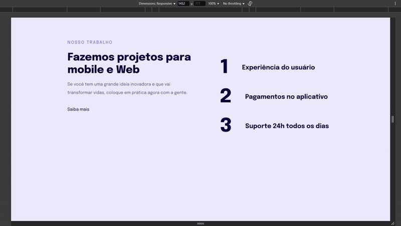

# Projeto - Resposividade

> Este é um exemplo de uma página HTML responsiva que destaca os serviços oferecidos por uma empresa de desenvolvimento de projetos para dispositivos móveis e web. A página é projetada para fornecer uma introdução atraente e informativa sobre os serviços oferecidos pela empresa. Esse é um projeto feito com orientação da Rocketseat durante a formação Explorer, o intuito desse projeto é ensinar sobre Responsividade.

## Funcionalidades

- **Apresentação dos Serviços**: A página apresenta os serviços oferecidos pela empresa em um formato claro e conciso, destacando a experiência do usuário, pagamentos no aplicativo e suporte 24 horas por dia, todos os dias.

- **Design Responsivo**: O layout da página é responsivo e se adapta a diferentes tamanhos de tela, garantindo uma boa experiência do usuário em dispositivos móveis e desktops.

- **Estilos de CSS Personalizados**: O arquivo style.css contém estilos personalizados para formatar e estilizar a página. Os estilos incluem definições para o layout, tipografia, cores e espaçamento.
## Stack utilizada

**Front-end:** HTML, CSS

## Aprendizados

- Media Queries
- Unidades de medidas relativas

